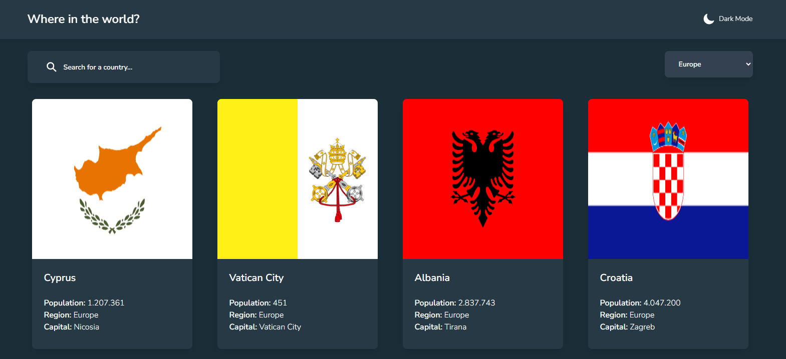

# Countries App

## Overview

- This project is an advanced challenge from frontendmentor.io
- You can see a live demo of this project [here](https://countries-app-nguyendonuet.netlify.app/).

## Features

- See all countries from the API on the homepage
- Search for a country using an input field
- Filter countries by region
- Click on a country to see more detailed information on a separate page
- Click through to the border countries on the detail page
- View the optimal layout for the interface depending on their device's screen size
- See hover and focus states for all interactive elements on the page
- Bonus: Toggle the color scheme between light and dark mode

## Tech Stack

- React: A JavaScript library for building user interfaces.
- Context API: A feature provided by React for state management and data sharing.
- Tailwind CSS: A utility-first CSS framework for rapidly building custom user interfaces.

## Resources

- [Challenge link](https://www.frontendmentor.io/challenges/rest-countries-api-with-color-theme-switcher-5cacc469fec04111f7b848ca)
- [REST Countries API](https://restcountries.com/v3.1)
